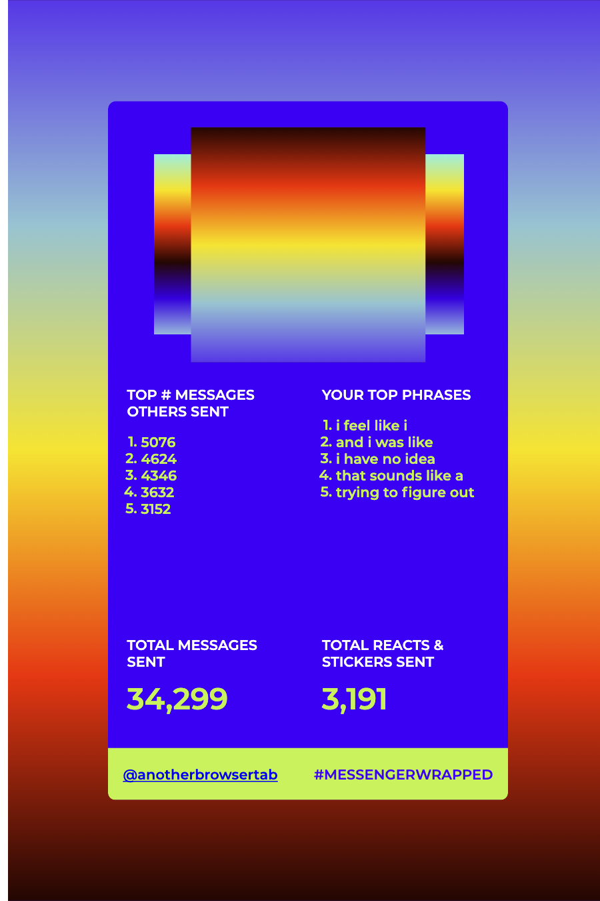

# 2020 Messenger Wrapped

Designed to run locally so that you don't have to upload your Messenger data elsewhere to generate this image.

Download your own Facebook Messenger data, use the `generate_messenger_wrapped.py` script to run through it, and then open `index.html` to view and download a "Messenger Wrapped" image!

This code is very experimental and not well tested as of early December 2020; I built this to look through my own Messenger data from 2020 after seeing lots of 2020 Spotify Wrapped data floating around. I wanted to share it here in case anyone would like to try this out on their own data.

note: right now, the top phrases returned are often heavily skewed by automated messages from games (e.g. Words With Friends Day 1, etc)!

## To run Messenger Wrapped, you will need:
- Python 3
- Chrome or Firefox browser (also tested Safari, where the save image button does not work, but it is possible to view the image and then screenshot it in that browser. These are just the browsers I have tested so far!)

## Messenger Wrapped uses the following external resources:
- [Google Fonts](https://fonts.google.com/)
- [html2canvas](https://github.com/niklasvh/html2canvas)

## How to use Messenger Wrapped
1. Download your Facebook Messenger data for January 1 2020 - December 1 2020 (or some later date in 2020).
- To get to "Download Your Information" on Facebook: Settings & Privacy > Settings > Your Facebook Information > Download Your Information
- Under "Your Information", deselect all and then only reselect "Messages". 
- Set "Date Range" to January 1 2020 to the latest possible date in 2020 (or some other date in 2020 of your choice).
- Set "Format" to JSON.
- Set "Media Quality" to Low (no code references attached media, but this should speed up download times and reduce file sizes).
- Click "Create File" -- it may take a while for Facebook to prepare the file, but I received a notification when my data was ready for download.

2. Download your Facebook Messenger data once it's available.

3. Pull this repository. Place your extracted Facebook data folder (mine was named `messages`) inside the `2020messengerwrapped` directory. The directory should then look like:
- `generate_messenger_wrapped.py`
- `index.html`
- `README.md`
- `css/`
- `js/`
- `messages/`

4. In the `2020messengerwrapped` directory, run `generate_messenger_wrapped.py` in your terminal.
- This script will ask for several inputs:
  - **Your name as used on Facebook/Messenger**. This is so that your name is recognized while going through your data so that messages, reactions, and stickers are properly attributed (or not attributed) to you.
    - Capitalization and whitespace/spaces matter.
  - **The names of any senders you would like to omit from your list of top senders**, separated by commas.
  - **The length of your top phrases that you would like to look for in messages you sent, measured by number of words**. This must be a number between 3 and 8 inclusive. The default number of words in a phrase is 4.
  - **Any phrases you would like to omit from your list of most commonly used phrases**, separated by commas. Please omit punctuation from these phrases. If any of these phrases are found in a message that you send, that entire message will be ignored when counting up your most frequently used phrases.
  - **If you'd like to view the names of the 25 people who sent you the most messages as found in your data**, in the format `(name, total number of messages that person sent you)`. If you indicate yes, it will print out those names sorted from most messages sent to least messages sent.
    - I don't think this script differentiates between different people who use the same display name on Facebook :(
  - **Which you would prefer to share in your Messenger Wrapped file**: the *names* of the 5 people who sent you the most messages this year, or the *number of messages sent* by the 5 people that sent you the most messages this year. Type "names" to share the names, and type anything else to share the numbers instead.
  - **If you'd like to view your top 100 phrases**, in the format `(phrase, total number of occurrences)`. If you indicate yes, it will print out those phrases sorted from highest to lowest frequency.
  - The output of this script is `js/your_messenger_wrapped.js`.
  - **If you'd like to add a custom image to your Messenger Wrapped**. Please specify the name of the file including its file type, e.g. "photo.jpg". Add this file to the `images` directory. **If this is done, the Save Image button will not work**. Please take a screenshot of the page to capture Messenger Wrapped with the custom photo included.

5. In the `2020messengerwrapped` directory, open `index.html` to view and download your Messenger Wrapped image!

Some more notes on the `index.html` file and its output:
- Google Fonts is used to provide the font "Montserrat".
- html2canvas is used to generate a canvas that is then turned into the PNG file downloaded upon clicking the "save image" button.
- The image is generated using the data in `js/your_messenger_wrapped.js`. Edit the values in that file to update the Messenger Wrapped image.
- The data shown is:
  - **Top People/Top # Messages Others Sent**: either the names of the people (max 5) who sent you the most messages this year, or the number of messages that each of those people sent you this year.
  - **Your Top Phrases**: phrases (max 5) that appeared the most in the messages you sent.
  - **Total Messages Sent**: the total number of messages sent by you (and anyone else sharing your name on Facebook that sent you messages).
  - **Total Reacts & Stickers Sent**: the total number of reactions used and stickers sent by you (and anyone else sharing your name on Facebook that sent you messages).

Messenger Wrapped By [@anotherbrowsertab](https://www.instagram.com/anotherbrowsertab/) on Instagram